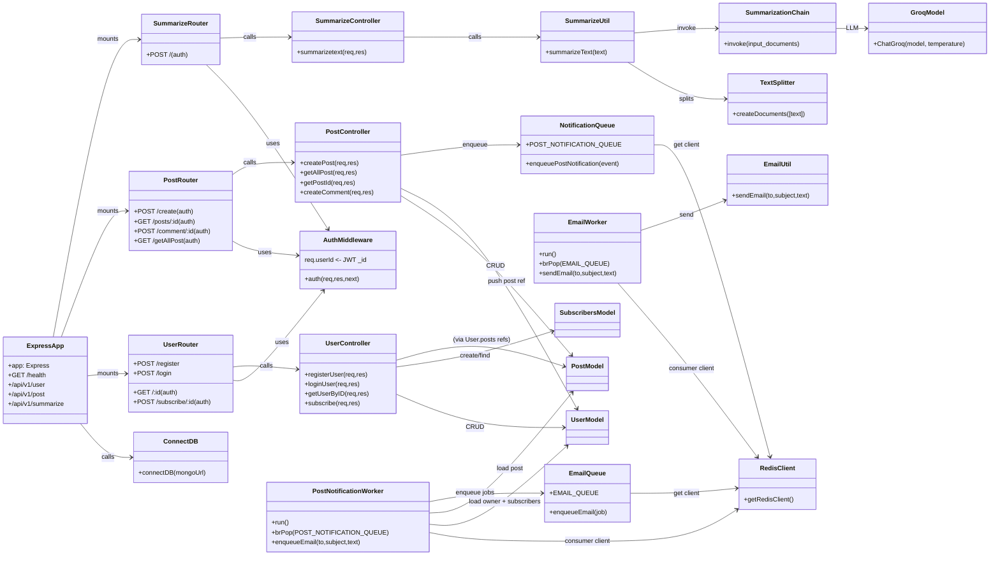

# Backend Architecture

This document describes the **backend** under `backend/` (Express + MongoDB + Redis queues + workers).

## High-level flow diagram

```mermaid
flowchart TD
  %% Clients
  Client[Client (Web/Mobile)] -->|HTTP JSON| API[Express API\nbackend/index.ts]

  %% Middleware & routing
  API --> Routes[Routers\nUserRouter / PostRouter / summarizeRouter]
  Routes --> Auth[JWT auth middleware\nbackend/middleware/auth.ts]

  %% Controllers
  Auth --> UserCtrl[UserController\nregister/login/getUser/subscribe]
  Auth --> PostCtrl[PostController\ncreatePost/getPost/createComment/getAllPost]
  Auth --> SumCtrl[SummarizeController\nsummarizetext]

  %% Data layer
  UserCtrl --> Mongo[(MongoDB via Mongoose)]
  PostCtrl --> Mongo
  SumCtrl --> LLM[LangChain + Groq model\nutils/summarize.ts]

  Mongo --> UserModel[User model\nmodel/UserSchema.ts]
  Mongo --> PostModel[Post model\nmodel/PostSchema.ts]
  Mongo --> SubscribersModel[Subscribers model\nmodel/SubscriberSchema.ts]

  %% Async notifications pipeline
  PostCtrl -->|enqueuePostNotification| Redis[(Redis)]
  Redis -->|LPUSH post_notifications_queue| PostQueue[post_notifications_queue\nutils/notificationQueue.ts]

  PostWorker[postNotificationWorker.ts\nconsumer loop] -->|BRPOP post_notifications_queue| Redis
  PostWorker --> Mongo
  PostWorker -->|enqueueEmail| Redis

  EmailWorker[emailWorker.ts\nconsumer loop] -->|BRPOP email_queue| Redis
  EmailWorker --> Mail[Nodemailer Gmail OAuth2\nutils/email.ts]

  %% Observability-ish
  API --> Health[/GET /health/]
```

## LLD diagram (modules and key dependencies)



## Notes / runtime responsibilities

- **API process**: serves HTTP; authenticates via JWT; writes/reads MongoDB; enqueues background work to Redis.
- **`postNotificationWorker.ts`**: consumes `post_notifications_queue`, loads the post + creator + subscribers, and enqueues email jobs.
- **`emailWorker.ts`**: consumes `email_queue` and sends email via Nodemailer (Gmail OAuth2 env vars).

